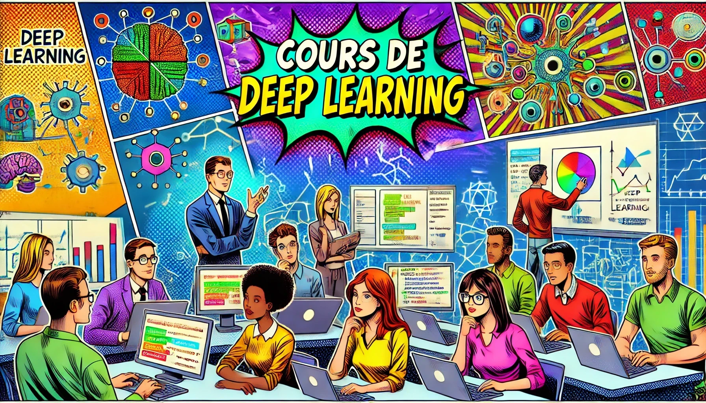

<p align="center">
  <h1><center> 	🚀 Learn Deep Learning from Scratch 🚀</h1>
</p>



## 📚 Description

This repository offers introductory Deep Learning courses based on interactive notebooks.
For beginners, the courses should be taken in order for better overall understanding.

A multilingual website is available for easier navigation: [**🌐 Website 🌐**](https://simonthomine.github.io/CoursDeepLearning/)

### 🌍 Available Languages

- 🇫🇷 **Français** - Version française complète
- 🇺🇸 **English** - Complete English version  
- 🇪🇸 **Español** - Versión completa en español
- 🇨🇳 **中文** - 完整中文版

### 🛠️ Environment Setup 
All libraries needed for the course are available in requirements.txt. You can choose to install everything at once or progressively as you advance through the course.   
It is recommended to use a conda environment to avoid conflicts with libraries already installed on your computer.  

```bash
pip install -r requirements.txt
```

## 🗺️ Course Structure

### 1. 🏗️ Foundations
Introduction to gradient descent optimization, intuitive understanding of the chain rule, and first steps with logistic regression.

### 2. 🧠 Fully Connected Networks
Explore how neural networks work using [micrograd](https://github.com/karpathy/micrograd/tree/master) and then with PyTorch. Introduction to advanced training techniques to improve performance.

### 3. 🖼️ Convolutional Networks
Presentation of convolutional layers and their use in neural networks. Practical examples: classification on MNIST, CIFAR-10, and image segmentation.

### 4. 🔄 Autoencoders
Discover unsupervised learning with autoencoders: anomaly detection and image denoising.

### 5. 🗨️ NLP
Introduction to natural language processing inspired by the ["Building makemore"](https://www.youtube.com/playlist?list=PLAqhIrjkxbuWI23v9cThsA9GvCAUhRvKZ) series: from simple models to more complex architectures for text prediction.

### 6. 🤗 Hugging Face
Explore the [Hugging Face](https://huggingface.co/) platform: discover models, datasets, and libraries (transformers, diffusers, gradio) for various use cases.

### 7. 🤖 Transformers
Detailed study of the transformer architecture: step-by-step implementation, mathematical explanations, various applications (vision, translation...), and introduction to vision transformer.

### 8. 🔍 Object Detection (YOLO)
Presentation of object detection methods (two-stage, one-stage), focus on [YOLO](https://arxiv.org/pdf/1506.02640) and use of the [ultralytics](https://www.ultralytics.com/) library.

### 9. 🎯 Contrastive Training
Introduction to contrastive training: implementation for face verification and applications to unsupervised learning.

### 10. 🤝 Transfer Learning and Distillation
Transfer learning and knowledge distillation concepts: practical implementations, distillation for anomaly detection, and LLM finetuning with BERT and Hugging Face.

### 11. 🌀 Generative Models
Presentation of the major families of generative models: GANs, VAEs, normalizing flows, diffusion models (excluding autoregressive models already covered in NLP/Transformers).

### 12. 🌟 Bonus – Specific Courses
Advanced concepts and complementary techniques: BatchNorm, residual connections, optimizers, dropout, data augmentation, etc.

## 🚀 Getting Started

1. **Choose your language** on the [website](https://simonthomine.github.io/CoursDeepLearning/)
2. (Optionally) **Install dependencies**: `pip install -r requirements.txt`
3. **Start with Foundations** and progress through the curriculum
4. **Practice with the interactive notebooks** in your preferred language

## 📖 Course Navigation

- **Interactive Website**: Browse all courses with multilingual support
- **GitHub Repository**: Access source notebooks and materials
- **Language Switching**: Seamlessly switch between French, English, Spanish, and Chinese

---

**License**

This work is licensed under the MIT License

---

*Start your learning journey by exploring the foundations of Deep Learning!*